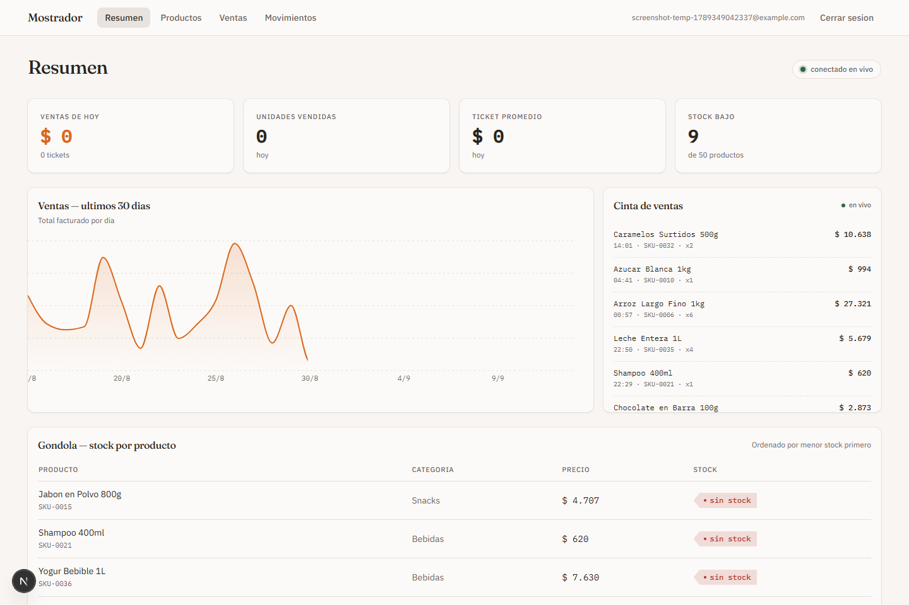
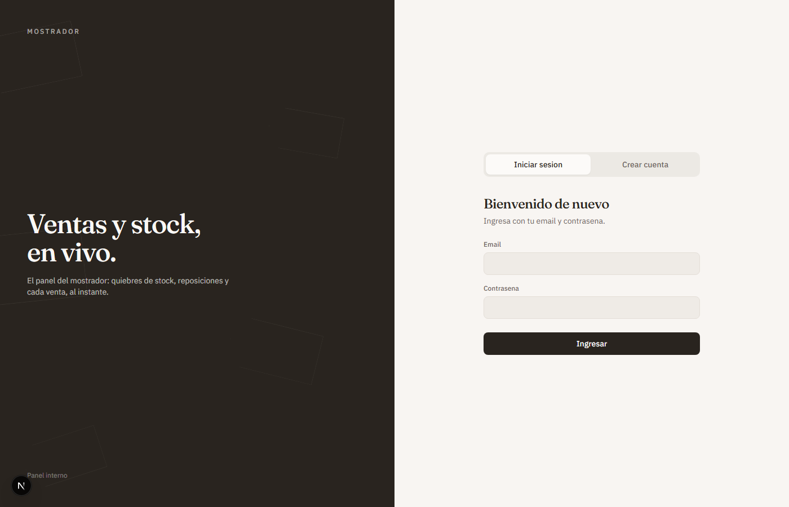
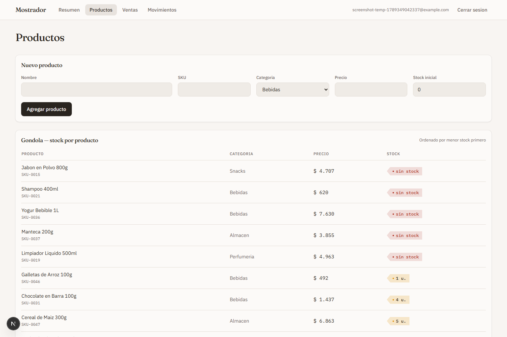

<div align="center">

# Mostrador

**Panel de ventas y stock en tiempo real para un comercio de barrio**

[](https://github.com/AgustinU28/Stock-Dashboard/actions/workflows/ci.yml)




</div>

## Qué es

Una herramienta de un solo mostrador (no multi-tenant): ves las ventas del
día, el gráfico de los últimos 30 días, una cinta de ventas que se actualiza
sola apenas entra una venta nueva, y la góndola con el stock ordenado por lo
que se está por terminar — todo vía **Supabase Realtime**, sin refrescar la
página. Ver [`.interface-design/system.md`](.interface-design/system.md)
para la dirección de diseño completa (tokens, tipografías, componentes).

## Funcionalidad

- **Resumen en vivo** — KPIs del día, gráfico de ventas, cinta de ventas y
  tabla de stock que flashean al llegar un evento nuevo (Realtime).
- **Productos** — alta y listado, ordenado por menor stock primero.
- **Ventas** — registrar una venta (valida contra el stock disponible) e
  historial completo.
- **Movimientos de stock** — reposición, merma o ajuste, con motivo — la
  tabla que el schema siempre tuvo pero que ahora tiene UI.
- **Auth** — Supabase Auth (email/password) con registro propio, toda la app
  protegida por middleware.

<table>
<tr>
<td width="50%"></td>
<td width="50%"></td>
</tr>
</table>

## Stack

- **Next.js 16** (App Router, React 19), TypeScript
- **Supabase**: Postgres, Row Level Security, Realtime, Auth
- **Tailwind CSS** + primitivas propias estilo shadcn
- **recharts** para el gráfico de ventas

## Puesta en marcha

### 1. Instalar dependencias

```bash
npm install
```

### 2. Variables de entorno

Copiá `.env.local.example` a `.env.local` y completá con los datos de tu
proyecto de Supabase (Project Settings → API):

```bash
cp .env.local.example .env.local
```

- `NEXT_PUBLIC_SUPABASE_URL` / `NEXT_PUBLIC_SUPABASE_ANON_KEY` — públicas,
  se usan en el navegador.
- `SUPABASE_SERVICE_ROLE_KEY` — solo si vas a correr el seed. Sacala de la
  misma pantalla (secreto `service_role`). **Nunca** la expongas al browser
  ni la commitees.

### 3. Base de datos

Corré las migraciones, en orden, contra tu proyecto (Supabase dashboard →
SQL Editor → pegar el contenido → Run):

1. [`supabase/migrations/0001_init_schema.sql`](supabase/migrations/0001_init_schema.sql)
   — tablas (`products`, `sales`, `stock_movements`), triggers que mantienen
   `stock_quantity` sincronizado, RLS, y las tablas agregadas a la
   publicación `supabase_realtime`.
2. [`supabase/migrations/0002_auth.sql`](supabase/migrations/0002_auth.sql)
   — reemplaza las políticas RLS públicas por políticas que exigen un
   usuario autenticado.

### 4. Crear un usuario

`/login` tiene un formulario de registro ("Crear cuenta") además del de
inicio de sesión. Si tu proyecto de Supabase tiene "Confirm email" activado
(Authentication → Providers → Email), vas a tener que confirmar el mail
antes de poder ingresar — si preferís saltarte eso para uso personal,
desactivalo ahí, o cargá el usuario directo desde Supabase dashboard →
**Authentication → Users → Add user**.

> [!NOTE]
> Cualquiera que llegue a `/login` puede crear una cuenta y va a tener
> acceso completo de lectura/escritura (las políticas RLS solo exigen
> "autenticado", no un usuario específico) — razonable mientras el proyecto
> corre en local o no está linkeado públicamente; si lo desplegás en un
> dominio público, considerá sacar el self-signup o agregar una allowlist
> de emails.

### 5. (Opcional) poblar datos de ejemplo

```bash
npm run seed
```

Necesita `SUPABASE_SERVICE_ROLE_KEY` en `.env.local` — inserta ~50 productos
y ~200 ventas de los últimos 30 días, respetando el stock disponible.

### 6. Correr

```bash
npm run dev
```

Abrí http://localhost:3000 — te va a redirigir a `/login`.

## Scripts

| Comando | Qué hace |
|---|---|
| `npm run dev` | Servidor de desarrollo (Turbopack) |
| `npm run dev:webpack` | Servidor de desarrollo con webpack en vez de Turbopack (fallback) |
| `npm run build` | Build de producción |
| `npm run start` | Sirve el build de producción |
| `npm run lint` | ESLint |
| `npm run typecheck` | `tsc --noEmit` |
| `npm run seed` | Puebla la base con datos de ejemplo |

## Estructura

```
app/
  login/              pantalla de login (fuera del shell autenticado)
  (app)/              rutas protegidas por proxy.ts
    page.tsx            resumen: KPIs, gráfico, cinta de ventas, stock
    productos/          alta y listado de productos
    ventas/              registrar venta + historial
    movimientos/         reposición/merma de stock + historial
components/
  dashboard/          componentes de las páginas del panel
  ui/                 primitivas (Card, Button, Input, PriceTag, ...)
lib/
  supabase/           clientes de Supabase (browser, server)
  utils/              cn, formato de moneda/fecha
supabase/
  migrations/         SQL versionado
scripts/seed.mjs      script de datos de ejemplo
proxy.ts              gate de autenticación (antes middleware.ts)
```

## Seguridad

Todas las tablas tienen RLS habilitada. Antes de `0002_auth.sql`, cualquiera
con la `anon key` podía leer y escribir — intencional en el scope inicial de
demo. Después de `0002_auth.sql`, todo requiere sesión autenticada (ver la
nota sobre self-signup en el paso 4).

## CI

[`.github/workflows/ci.yml`](.github/workflows/ci.yml) corre typecheck,
lint y build en cada push/PR a `main`.
